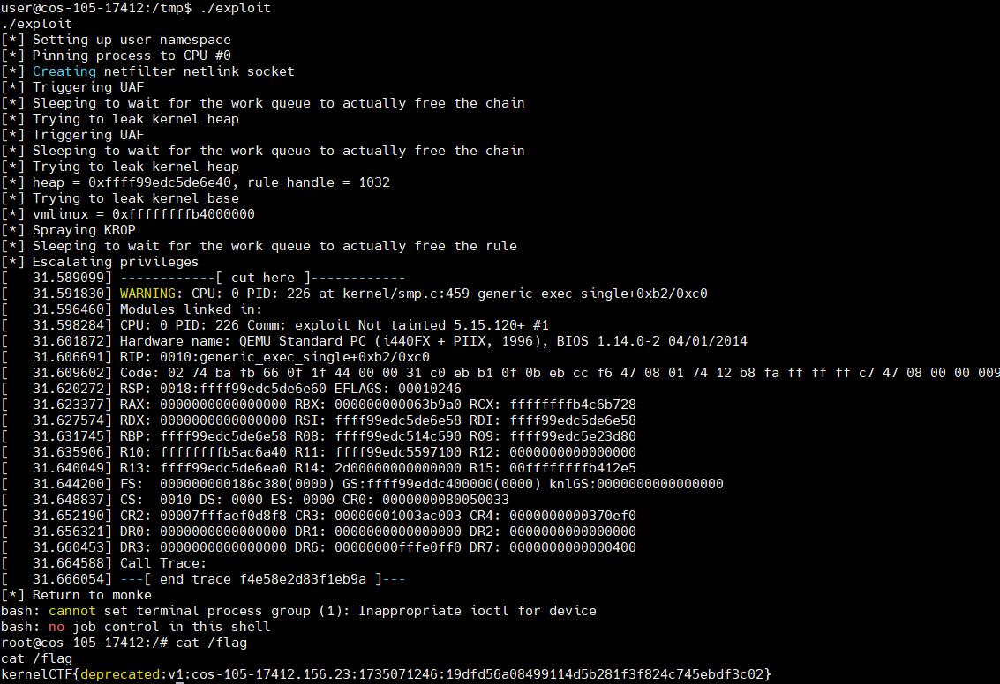

# CVE-2023-5197

## trigger uaf

- Create a table `t`
- Create a chain `c1`
- Create a chain `c2` hosting a rule `r2` that has an immediate expression `e2` which binds to `c1`
    + `c1->use == 1`
- Create a chain `c3` hosting a rule `r3` that has an immediate expression `e3` which binds to `c1`
    + `c3` should have `NFT_CHAIN_BINDING` flag
    + `c1->use = 2`
- Delete rule `r3`: -> `nft_immediate_deactivate(e3)`
    + `c1->use = 1`
- Create a chain `c4` hosting a rule `r4` that has an immediate expression `e4` which binds to `c3`
- Delete rule `r4`: -> `nft_immediate_deactivate(e3)`
    + `c1->use = 0`
- Because `c1->use = 0`, we can delete chain `c1`

## exploit

the exploit is identical to CVE-2023-4015: [link](https://github.com/google/security-research/tree/c09b0b76162342fc349be2cea4ddf0ae01fa5302/pocs/linux/kernelctf/CVE-2023-4015_cos)

## target

kCTF - cos-105-17412.156.23:
```
Kernel image (bzImage): https://storage.googleapis.com/kernelctf-build/releases/cos-105-17412.156.23/bzImage
Kernel image (vmlinux): https://storage.googleapis.com/kernelctf-build/releases/cos-105-17412.156.23/vmlinux.gz
Kernel config: https://storage.googleapis.com/kernelctf-build/releases/cos-105-17412.156.23/.config
  -> derived from COS config: https://storage.googleapis.com/kernelctf-build/releases/cos-105-17412.156.23/lakitu_defconfig
Source code info: https://storage.googleapis.com/kernelctf-build/releases/cos-105-17412.156.23/COMMIT_INFO
```


