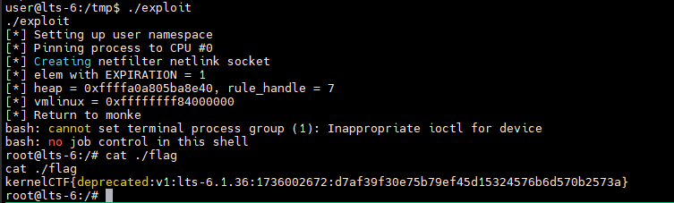

# CVE-2023-4244

race condition between nf_tables netlink control plane transaction and nft_set element garbage collection.\
missing call to nft_set_elem_mark_busy.

## trigger uaf

- Batch 1
    - Create a table `t`
    - Create a chain `c1`
    - Create a chain `c2` hosting a rule `r2` that has an immediate expression `e2` which binds to `c1`
        + `c1->use == 1`
- Batch 2
    - Create a set `s1` with `NFT_SET_MAP | NFT_SET_TIMEOUT` flag and `gc_interval = 1`
    - Create a set element `se1` with data as verdict jump to `c1` and `expiration = 1`
        + `c1->use == 2`
    
- Batch 3
    - Immediately delete set element `se1` before garbage collector removes it
        + `c1->use == 1`

- If garbage collector runs before commit_release, `c1->use` will decrease one more time:
    + `c1->use == 0`

- Batch 4
    - Because `c1->use = 0`, we can delete chain `c1`

If race fails, run again.

## target

kCTF - lts-6.1.36:
```
Kernel image (bzImage): https://storage.googleapis.com/kernelctf-build/releases/lts-6.1.36/bzImage
Kernel image (vmlinux): https://storage.googleapis.com/kernelctf-build/releases/lts-6.1.36/vmlinux.gz
Kernel config: https://storage.googleapis.com/kernelctf-build/releases/lts-6.1.36/.config
  -> derived from COS config: https://storage.googleapis.com/kernelctf-build/releases/lts-6.1.36/lakitu_defconfig
Source code info: https://storage.googleapis.com/kernelctf-build/releases/lts-6.1.36/COMMIT_INFO
```

